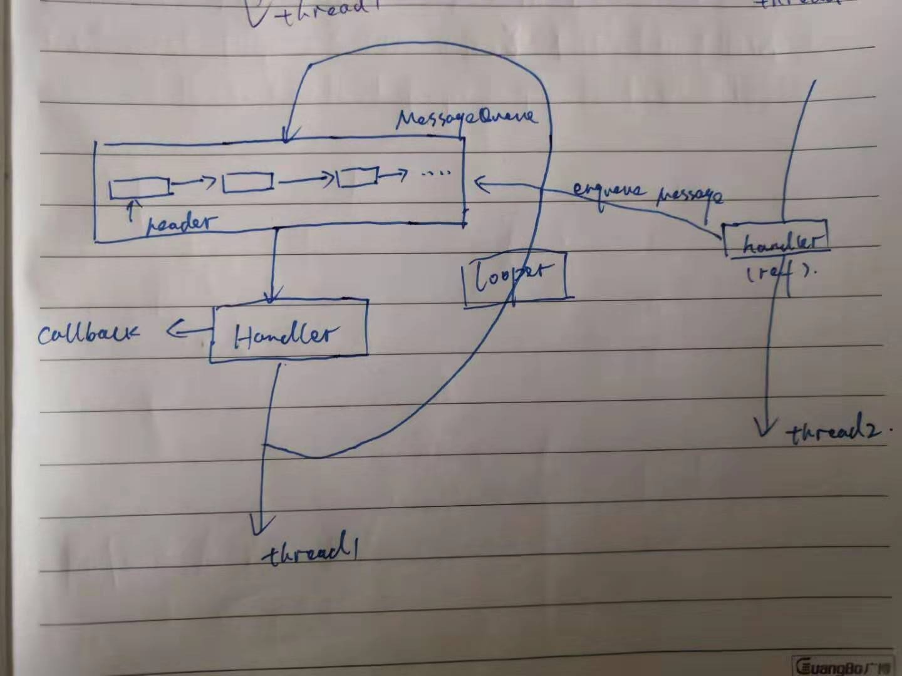

# Android系统消息处理机制

## 前言

在Android应用开发中，主线程一般都是UI操作，子线程去完成一些耗时操作。主线程会一直等待系统或者用户的响应，从而完成对UI的渲染和显示。在学些之前，先了解两个linux的知识点：

- 管道(pipe)：管道是一种IPC机制，作用于有血缘关系的进程之间，完成数据传递，调用pipe系统函数可创建一个管道。其本质是一个虚拟文件（实际为内核缓冲区），采用半双工通信方式，数据只能在一个方向流动。

```c
 int pipe(int pipefd[2]);  //成功：0；失败：-1，设置errno
```

函数调用成功后返回r/w两个文件描述符，无需open，但要显示的close，fd[0] --> r，fd[1] --> w，向管道文件读写数据实际上是在读写内核缓冲区。下面是完成进程间通信的调用逻辑：

1) 父进程调用pipe函数创建管道，得到两个文件描述符fd[0]、fd[1]指向管道的读写端。

2) 父进程调用fork创建子进程，那么子进程也有两个文件描述符指向同一管道。

3)父进程关闭管道读端，子进程关闭管道写端。父进程可以向管道中写入数据，子进程向管道中的数据读出，由于管道是利用环形缓冲区实现得，数据从写端流入管道，从读端流出，这样就实现了进程间通信。


- epoll 机制：epoll是linux内核的一种可拓展的IO事件处理机制，比select和poll等多路复用的方法相比，性能更加出色，具体对epoll机制的原理解释见博客[高并发网络编程epoll详解](<https://blog.csdn.net/shenya1314/article/details/73691088> )，下面是函数原型：

  ```c
  //创建一个epoll的句柄，size告诉内核需要监听的数目一共有多大
  int epoll_create(int size);
  /** 
  1)epoll的事件注册函数，第一个参数是epoll_create的返回值 
  2)第二个参数表示动作，使用如下三个宏表示：
  EPOLL_CTL_ADD    //注册新的fd到epfd中；
  EPOLL_CTL_MOD    //修改已经注册的fd的监听事件；
  EPOLL_CTL_DEL    //从epfd中删除一个fd；
  3)第三个参数是需要监听的fd
  4)第四个参数是告诉内核需要监听什么事，struct epoll_event结构：
  
  typedef union epoll_data
  {
    void        *ptr;
    int          fd;
    __uint32_t   u32;
    __uint64_t   u64;
  } epoll_data_t;
  
  struct epoll_event {
  __uint32_t events; // Epoll events
  epoll_data_t data; // User data variable
  };
  
  events可以是以下几个宏的集合：
  EPOLLIN     //表示对应的文件描述符可以读（包括对端SOCKET正常关闭）；
  EPOLLOUT    //表示对应的文件描述符可以写；
  EPOLLPRI    //表示对应的文件描述符有紧急的数据可读（这里应该表示有带外数据到来）；
  EPOLLERR    //表示对应的文件描述符发生错误；
  EPOLLHUP    //表示对应的文件描述符被挂断；
  EPOLLET     //将EPOLL设为边缘触发(Edge Triggered)模式，这是相对于水平触发(Level Triggered)来说的。
  EPOLLONESHOT//只监听一次事件，当监听完这次事件之后，如果还需要继续监听这个socket的话，需要再次把这               个socket加入到EPOLL队列里。
  **/
  int epoll_ctl(int epfd, int op, int fd, struct epoll_event *event);
  //通过此调用收集在epoll监控中已经发生的事件
  int epoll_wait(int epfd, struct epoll_event *events, int maxevents, int timeout);
  ```

  

##  JAVA层代码分析



上图thread2线程持有handler的引用，像MessageQueue插入一条消息，thread1线程通过looper将MessageQueue中的消息读取出来并执行，所以，callback是在thread1线程中执行的。由thread2发送消息，具体由thread1执行，这样就完成了线程切换。下来来具体分析下如何实现的。

```java
 
  *  class LooperThread extends Thread {
  *      public Handler mHandler;
  *
  *      public void run() {
  *          Looper.prepare();
  *
  *          mHandler = new Handler() {
  *              public void handleMessage(Message msg) {
  *                  // process incoming messages here
  *              }
  *          };
  *
  *          Looper.loop();
  *      }
```

这个是官方给的实例代码，告诉我们Android里面事件驱动线程该是如何执行起来的。首先执行prepare，保存线程的Looper对象，然后执行looper()方法。

```java
  public static void loop() {
        final Looper me = myLooper();
        if (me == null) {
            throw new RuntimeException("No Looper; Looper.prepare() wasn't called on this thread.");
        }
        final MessageQueue queue = me.mQueue;

        ....

        for (;;) {
            Message msg = queue.next(); // might block
            if (msg == null) {
                // No message indicates that the message queue is quitting.
                return;
            }

            // This must be in a local variable, in case a UI event sets the logger
            Printer logging = me.mLogging;
            if (logging != null) {
                logging.println(">>>>> Dispatching to " + msg.target + " " +
                        msg.callback + ": " + msg.what);
            }

            msg.target.dispatchMessage(msg);

           ...
        }
    }
```

loop方法首先做的是获取当前线程的looper对象，然后获取到MessageQueue，由此可见，looper和MessageQueue是一一对应的，最后执行了MessageQueue的next方法，获取到消息Message，然后交由msg.target去处理，其实就是handler。一起看看next:

```java
//Java 层调用 nativePollOnce  
Message next() {
        // Return here if the message loop has already quit and been disposed.
        // This can happen if the application tries to restart a looper after quit
        // which is not supported.
        final long ptr = mPtr;
        if (ptr == 0) {
            return null;
        }

        int pendingIdleHandlerCount = -1; // -1 only during first iteration
        int nextPollTimeoutMillis = 0;
        for (;;) {
            if (nextPollTimeoutMillis != 0) {
                Binder.flushPendingCommands();
            }

            nativePollOnce(ptr, nextPollTimeoutMillis);

            ...
        }
    }

//最终会调用到这里来，省略的逻辑到native层分析
int Looper::pollInner(int timeoutMillis) {

    ...

    //会监听已经发生的事件,毫秒，0会立即返回，-1将不确定，也有说法说是永久阻塞
    //当没有消息来，线程将进入休眠，不会耗费cpu资源
    struct epoll_event eventItems[EPOLL_MAX_EVENTS];
    int eventCount = epoll_wait(mEpollFd, eventItems, EPOLL_MAX_EVENTS, timeoutMillis);


    ....

    // 返回timeout.
    if (eventCount == 0) {
        result = POLL_TIMEOUT;
        goto Done;
    }

    ...
    
    return result;
}
```

到这里，线程会进入休眠状态，我们去看看哪里将其唤醒：

```c
   boolean enqueueMessage(Message msg, long when) {
        if (msg.target == null) {
            throw new IllegalArgumentException("Message must have a target.");
        }
        if (msg.isInUse()) {
            throw new IllegalStateException(msg + " This message is already in use.");
        }

        synchronized (this) {
            if (mQuitting) {
                IllegalStateException e = new IllegalStateException(
                        msg.target + " sending message to a Handler on a dead thread");
                Log.w("MessageQueue", e.getMessage(), e);
                msg.recycle();
                return false;
            }

            //插入Message消息
            ...

            // mPtr保存的 native层的 MessageQueue对象
            if (needWake) {
                nativeWake(mPtr);
            }
        }
        return true;
    }

//通过Jni调用的 native层
void Looper::wake() {
#if DEBUG_POLL_AND_WAKE
    ALOGD("%p ~ wake", this);
#endif

    ssize_t nWrite;
    do {
        //这里向管道写端写入字符，epoll监听了管道读端的fd，所以epoll_wait所在线程将被唤醒
        //最后Java端 MessageQueue也就返回一个Message对象给Handler处理。
        nWrite = write(mWakeWritePipeFd, "W", 1);
    } while (nWrite == -1 && errno == EINTR);

    if (nWrite != 1) {
        if (errno != EAGAIN) {
            ALOGW("Could not write wake signal, errno=%d", errno);
        }
    }
}

```


## Native层Looper分析

在Native层的代码里，弱化了MessageQueue的概念，消息由Vector来管理，并且是Looper的一个成员变量。其实在Native层的消息处理机制Looper有两种用途，一种是创建一个管道，通过读写来唤醒线程，另外一种是通过监听设备节点来执行处理一些事件，其实这种Native层更为常见吧？像触摸事件的上报，也是epoll机制实现的。下面来分析下Native层的实现：

```c++
Looper::Looper(bool allowNonCallbacks) :
        mAllowNonCallbacks(allowNonCallbacks), mSendingMessage(false),
        mResponseIndex(0), mNextMessageUptime(LLONG_MAX) {
    
    //创建管道
    int wakeFds[2];
    int result = pipe(wakeFds);
    LOG_ALWAYS_FATAL_IF(result != 0, "Could not create wake pipe.  errno=%d", errno);

    mWakeReadPipeFd = wakeFds[0];
    mWakeWritePipeFd = wakeFds[1];

    result = fcntl(mWakeReadPipeFd, F_SETFL, O_NONBLOCK);
    LOG_ALWAYS_FATAL_IF(result != 0, "Could not make wake read pipe non-blocking.  errno=%d",
            errno);

    result = fcntl(mWakeWritePipeFd, F_SETFL, O_NONBLOCK);
    LOG_ALWAYS_FATAL_IF(result != 0, "Could not make wake write pipe non-blocking.  errno=%d",
            errno);

    mIdling = false;

    //创建epoll
    // Allocate the epoll instance and register the wake pipe.
    mEpollFd = epoll_create(EPOLL_SIZE_HINT);
    LOG_ALWAYS_FATAL_IF(mEpollFd < 0, "Could not create epoll instance.  errno=%d", errno);

    struct epoll_event eventItem;
    memset(& eventItem, 0, sizeof(epoll_event)); // zero out unused members of data field union
    eventItem.events = EPOLLIN;
    eventItem.data.fd = mWakeReadPipeFd;
    //监听管道的读端fd，也就是为什么向管道里写字符，能够唤醒线程的原因
    result = epoll_ctl(mEpollFd, EPOLL_CTL_ADD, mWakeReadPipeFd, & eventItem);
    LOG_ALWAYS_FATAL_IF(result != 0, "Could not add wake read pipe to epoll instance.  errno=%d",
            errno);
}
```

再来看看在哪里创建Looper的：

```c++
//和Java的调用很相似
sp<Looper> Looper::prepare(int opts) {
    bool allowNonCallbacks = opts & PREPARE_ALLOW_NON_CALLBACKS;
    //获取此线程的looper
    sp<Looper> looper = Looper::getForThread();
    if (looper == NULL) {
        looper = new Looper(allowNonCallbacks);
        Looper::setForThread(looper);
    }
    if (looper->getAllowNonCallbacks() != allowNonCallbacks) {
        ALOGW("Looper already prepared for this thread with a different value for the "
                "LOOPER_PREPARE_ALLOW_NON_CALLBACKS option.");
    }
    return looper;
}

sp<Looper> Looper::getForThread() {
    //多线程环境中，保证函数initTLSKey只执行一次
    int result = pthread_once(& gTLSOnce, initTLSKey);
    LOG_ALWAYS_FATAL_IF(result != 0, "pthread_once failed");

    return (Looper*)pthread_getspecific(gTLSKey);
}

void Looper::initTLSKey() {
    //为此线程设置私有变量，和Java 的ThreadLocal 类似
    int result = pthread_key_create(& gTLSKey, threadDestructor);
    LOG_ALWAYS_FATAL_IF(result != 0, "Could not allocate TLS key.");
}
```

和Java层类似，想要整个线程loop起来，native层需要调用pollAll方法。

```c++
int Looper::pollAll(int timeoutMillis, int* outFd, int* outEvents, void** outData) {
    if (timeoutMillis <= 0) {
        int result;
        do {
            //这种是需要立即处理的消息
            result = pollOnce(timeoutMillis, outFd, outEvents, outData);
        } while (result == POLL_CALLBACK);
        return result;
    } else {
        nsecs_t endTime = systemTime(SYSTEM_TIME_MONOTONIC)
                + milliseconds_to_nanoseconds(timeoutMillis);

        for (;;) {
            int result = pollOnce(timeoutMillis, outFd, outEvents, outData);
            if (result != POLL_CALLBACK) {
                return result;
            }

            nsecs_t now = systemTime(SYSTEM_TIME_MONOTONIC);
            timeoutMillis = toMillisecondTimeoutDelay(now, endTime);
            if (timeoutMillis == 0) {
                return POLL_TIMEOUT;
            }
        }
    }
}

int Looper::pollOnce(int timeoutMillis, int* outFd, int* outEvents, void** outData) {
    int result = 0;
    for (;;) {
        //处理掉epoll的事件
        //Vector<Response> mResponses, Looper的私有成员
        while (mResponseIndex < mResponses.size()) {
            const Response& response = mResponses.itemAt(mResponseIndex++);
            int ident = response.request.ident;
            if (ident >= 0) {
                int fd = response.request.fd;
                int events = response.events;
                void* data = response.request.data;
#if DEBUG_POLL_AND_WAKE
                ALOGD("%p ~ pollOnce - returning signalled identifier %d: "
                        "fd=%d, events=0x%x, data=%p",
                        this, ident, fd, events, data);
#endif
                if (outFd != NULL) *outFd = fd;
                if (outEvents != NULL) *outEvents = events;
                if (outData != NULL) *outData = data;
                return ident;
            }
        }

        if (result != 0) {
#if DEBUG_POLL_AND_WAKE
            ALOGD("%p ~ pollOnce - returning result %d", this, result);
#endif
            if (outFd != NULL) *outFd = 0;
            if (outEvents != NULL) *outEvents = 0;
            if (outData != NULL) *outData = NULL;
            return result;
        }

        //处理被监听的fd 事件
        result = pollInner(timeoutMillis);
    }
}

int Looper::pollInner(int timeoutMillis) {
#if DEBUG_POLL_AND_WAKE
    ALOGD("%p ~ pollOnce - waiting: timeoutMillis=%d", this, timeoutMillis);
#endif

    // Adjust the timeout based on when the next message is due.
    if (timeoutMillis != 0 && mNextMessageUptime != LLONG_MAX) {
        nsecs_t now = systemTime(SYSTEM_TIME_MONOTONIC);
        int messageTimeoutMillis = toMillisecondTimeoutDelay(now, mNextMessageUptime);
        if (messageTimeoutMillis >= 0
                && (timeoutMillis < 0 || messageTimeoutMillis < timeoutMillis)) {
            timeoutMillis = messageTimeoutMillis;
        }
#if DEBUG_POLL_AND_WAKE
        ALOGD("%p ~ pollOnce - next message in %lldns, adjusted timeout: timeoutMillis=%d",
                this, mNextMessageUptime - now, timeoutMillis);
#endif
    }

    // Poll.已经处理完 立即需要处理的消息了，等待唤醒。
    int result = POLL_WAKE;
    mResponses.clear();
    mResponseIndex = 0;

    // We are about to idle.
    mIdling = true;

    //前文已经分析过，等待事件的到来
    struct epoll_event eventItems[EPOLL_MAX_EVENTS];
    int eventCount = epoll_wait(mEpollFd, eventItems, EPOLL_MAX_EVENTS, timeoutMillis);

    // No longer idling.
    mIdling = false;

    // Acquire lock.
    mLock.lock();

    // Check for poll error.
    if (eventCount < 0) {
        if (errno == EINTR) {
            goto Done;
        }
        ALOGW("Poll failed with an unexpected error, errno=%d", errno);
        result = POLL_ERROR;
        goto Done;
    }

    // Check for poll timeout.
    if (eventCount == 0) {
#if DEBUG_POLL_AND_WAKE
        ALOGD("%p ~ pollOnce - timeout", this);
#endif
        result = POLL_TIMEOUT;
        goto Done;
    }

    // Handle all events.
#if DEBUG_POLL_AND_WAKE
    ALOGD("%p ~ pollOnce - handling events from %d fds", this, eventCount);
#endif

    //监控fd的事件来了
    for (int i = 0; i < eventCount; i++) {
        int fd = eventItems[i].data.fd;
        uint32_t epollEvents = eventItems[i].events;
        if (fd == mWakeReadPipeFd) {
            if (epollEvents & EPOLLIN) {
                awoken();
            } else {
                ALOGW("Ignoring unexpected epoll events 0x%x on wake read pipe.", epollEvents);
            }
        } else {
            ssize_t requestIndex = mRequests.indexOfKey(fd);
            if (requestIndex >= 0) {
                int events = 0;
                if (epollEvents & EPOLLIN) events |= EVENT_INPUT;
                if (epollEvents & EPOLLOUT) events |= EVENT_OUTPUT;
                if (epollEvents & EPOLLERR) events |= EVENT_ERROR;
                if (epollEvents & EPOLLHUP) events |= EVENT_HANGUP;
                pushResponse(events, mRequests.valueAt(requestIndex));
            } else {
                ALOGW("Ignoring unexpected epoll events 0x%x on fd %d that is "
                        "no longer registered.", epollEvents, fd);
            }
        }
    }
Done: ;

    //这里是处理Native层发出的消息,即Looper->sendMessage()
    // Invoke pending message callbacks.
    mNextMessageUptime = LLONG_MAX;
    while (mMessageEnvelopes.size() != 0) {
        nsecs_t now = systemTime(SYSTEM_TIME_MONOTONIC);
        const MessageEnvelope& messageEnvelope = mMessageEnvelopes.itemAt(0);
        if (messageEnvelope.uptime <= now) {
            // Remove the envelope from the list.
            // We keep a strong reference to the handler until the call to handleMessage
            // finishes.  Then we drop it so that the handler can be deleted *before*
            // we reacquire our lock.
            { // obtain handler
                sp<MessageHandler> handler = messageEnvelope.handler;
                Message message = messageEnvelope.message;
                mMessageEnvelopes.removeAt(0);
                mSendingMessage = true;
                mLock.unlock();

#if DEBUG_POLL_AND_WAKE || DEBUG_CALLBACKS
                ALOGD("%p ~ pollOnce - sending message: handler=%p, what=%d",
                        this, handler.get(), message.what);
#endif
                handler->handleMessage(message);
            } // release handler

            mLock.lock();
            mSendingMessage = false;
            result = POLL_CALLBACK;
        } else {
            // The last message left at the head of the queue determines the next wakeup time.
            mNextMessageUptime = messageEnvelope.uptime;
            break;
        }
    }

    // Release lock.
    mLock.unlock();

    //这里是回调监听设备节点的fd回调。
    // Invoke all response callbacks.
    for (size_t i = 0; i < mResponses.size(); i++) {
        Response& response = mResponses.editItemAt(i);
        if (response.request.ident == POLL_CALLBACK) {
            int fd = response.request.fd;
            int events = response.events;
            void* data = response.request.data;
#if DEBUG_POLL_AND_WAKE || DEBUG_CALLBACKS
            ALOGD("%p ~ pollOnce - invoking fd event callback %p: fd=%d, events=0x%x, data=%p",
                    this, response.request.callback.get(), fd, events, data);
#endif
            int callbackResult = response.request.callback->handleEvent(fd, events, data);
            if (callbackResult == 0) {
                removeFd(fd);
            }
            // Clear the callback reference in the response structure promptly because we
            // will not clear the response vector itself until the next poll.
            response.request.callback.clear();
            result = POLL_CALLBACK;
        }
    }
    return result;
}

```

下面看监听fd的方式如何添加的。

```c++
//函数指针
typedef int (*Looper_callbackFunc)(int fd, int events, void* data);

/**
 * A looper callback.
 */
class LooperCallback : public virtual RefBase {
protected:
    virtual ~LooperCallback() { }

public:
    /**
     * Handles a poll event for the given file descriptor.
     * It is given the file descriptor it is associated with,
     * a bitmask of the poll events that were triggered (typically EVENT_INPUT),
     * and the data pointer that was originally supplied.
     *
     * Implementations should return 1 to continue receiving callbacks, or 0
     * to have this file descriptor and callback unregistered from the looper.
     */
    virtual int handleEvent(int fd, int events, void* data) = 0;
};

/**
 *封装了函数指针
 */
class SimpleLooperCallback : public LooperCallback {
protected:
    virtual ~SimpleLooperCallback();

public:
    SimpleLooperCallback(Looper_callbackFunc callback);
    virtual int handleEvent(int fd, int events, void* data);

private:
    Looper_callbackFunc mCallback;
};

int Looper::addFd(int fd, int ident, int events, Looper_callbackFunc callback, void* data) {
    return addFd(fd, ident, events, callback ? new SimpleLooperCallback(callback) : NULL, data);
}

int Looper::addFd(int fd, int ident, int events, const sp<LooperCallback>& callback, void* data) {
       //...
        
       //这里添加了epoll监控的fd，等待线程接收到通知，会被唤醒，上文已分析
        ssize_t requestIndex = mRequests.indexOfKey(fd);
        if (requestIndex < 0) {
            int epollResult = epoll_ctl(mEpollFd, EPOLL_CTL_ADD, fd, & eventItem);
            if (epollResult < 0) {
                ALOGE("Error adding epoll events for fd %d, errno=%d", fd, errno);
                return -1;
            }
            mRequests.add(fd, request);
        } else {
            int epollResult = epoll_ctl(mEpollFd, EPOLL_CTL_MOD, fd, & eventItem);
            if (epollResult < 0) {
                ALOGE("Error modifying epoll events for fd %d, errno=%d", fd, errno);
                return -1;
            }
            mRequests.replaceValueAt(requestIndex, request);
        }
    } // release lock
    return 1;
}

```


## 两种方式的实现

1) 第一种方式是在Native层代码中发送消息，比较简单，自己简单实现了下：

```c++
  class WorkThread : public Thread {
	  
	  public :
	    bool threadLoop(){
			
			LOGI("thread loop ...");
			sleep(3);
			return true;
		}
	
  };


  class Handler : public MessageHandler {

    public:
		void handleMessage(const Message& message){

            LOGI("handleMessage... message what : %d", message.what);
		}
  };


  class TestThread : public Thread {

     public:
	 	TestThread():Thread(true){   /** true 表示是否可调用Java函数**/
            looper = new Looper(true);
			handler = new Handler;
		}

	virtual bool threadLoop(){
       LOGI("thread loop ... wait 100 seconds.");
	   if(looper != NULL){
          looper->pollAll(100 * 1000);
	   }

	   return true; /** 返回true表示一直轮询调用，false表示只调用一次 **/
	}

	void sendMessage(){
       if(looper != NULL && handler != NULL){
          LOGI("looper->sendMessage");
		  looper->sendMessage(handler,Message(100));
	   }
	}

	inline sp<Looper>& getLooper(){return looper;}

	 private:
	 	sp<Looper> looper;
		sp<Handler> handler;

  };

//在子线程里轮询，在主线程里发送消息
void testEventThread(){

	sp<TestThread> thread = new TestThread;
	thread->run("looperThread",PRIORITY_DEFAULT,0);
	
	thread->sendMessage();
	sleep(5);
	thread->sendMessage();
  
}

int main(int argc, char**argv){
    
   testEventThread();
   sleep(60);
   return 0;
} 

```


2) 第二种是添加设备节点的方式，监听事件的到来，源码的实现比较多，比如Android系统的显示模块，为了触发显示数据的合成，实现了一个MessageQueue，就是利用Looper监听fd。

```c++
void MessageQueue::init(const sp<SurfaceFlinger>& flinger)
{
    mFlinger = flinger;
    mLooper = new Looper(true);
    mHandler = new Handler(*this);
}

void MessageQueue::setEventThread(const sp<EventThread>& eventThread)
{
    mEventThread = eventThread;
    mEvents = eventThread->createEventConnection();
    mEventTube = mEvents->getDataChannel();
    mLooper->addFd(mEventTube->getFd(), 0, Looper::EVENT_INPUT,
            MessageQueue::cb_eventReceiver, this);
}

int MessageQueue::cb_eventReceiver(int fd, int events, void* data) {
    MessageQueue* queue = reinterpret_cast<MessageQueue *>(data);
    return queue->eventReceiver(fd, events);
}

```


