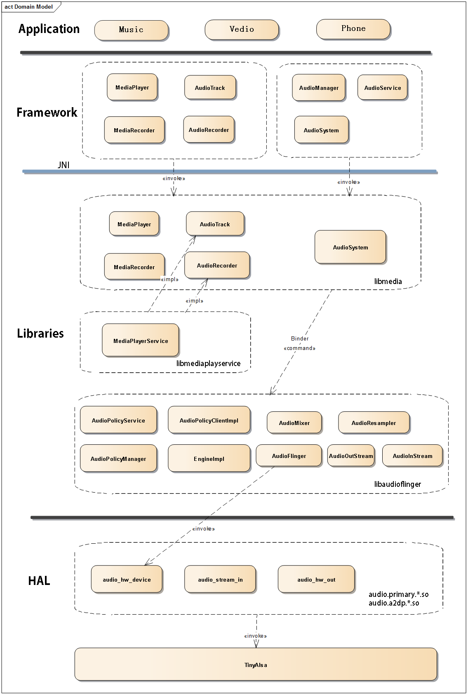

# Android系统音频模块 - Java 层初始化工作

## 前言

Android的音频模块相对来说是Android系统中比较简单的一个模块，但是仅仅是相对来说，Android系统中任何一个模块都非常的复杂，但是如果想学习framework相关的知识，我觉得音频模块是一个很好的切入点。Android系统中的音频模块几乎涵盖了Android系统中的所有层次，下图是它的框图（本人花了好长时间画的~）：

 

简单的介绍下这张图，Framework层和JNI层的工作相对来说比较简单，主要是对数据的一个验证、校验、封装传输的作用，核心的地方都是在Native层处理，包括对音频数据流的处理，音频策略的选择，HAL层主要是根据Native层选择的策略正确的将音频流写入声卡中，还有支持对上层的数据访问。而TinyAlsa是Linux一个轻量级的音频开源库，这里我们就不需要过多的了解，因为还要了解很多音频的相关专业知识，我们只需要知道音频pcm流是如何传输的，音频策略是如何选择的，整个音频框架是什么样的？这样就达到我们对音频模块的学习。


## 源码分析

由于篇幅问题，本篇先来学习下音频模块Java层的初始化流程，首先我们来看下AudioTrack的API使用，相信应用层的同学一般使用MediaPlayer比较多，而AudioTrack是更为底层的音频API接口，只能播放pcm流，没有编解码的功能。

```java
        int minBuffSize = AudioTrack.getMinBufferSize(8000,        //采样率
                AudioFormat.CHANNEL_OUT_STEREO,  //声道数: 双声道
                AudioFormat.ENCODING_PCM_16BIT); //采样精度： 16bit      

AudioTrack player = new AudioTrack.Builder()
                .setAudioAttributes(new AudioAttributes.Builder()
                        .setUsage(AudioAttributes.USAGE_ALARM)
                        .setContentType(CONTENT_TYPE_MUSIC)
                        .build())
                .setAudioFormat(new AudioFormat.Builder()
                        .setEncoding(AudioFormat.ENCODING_PCM_16BIT)
                        .setSampleRate(441000)
                        .setChannelMask(AudioFormat.CHANNEL_OUT_STEREO)
                        .build())
                .setBufferSizeInBytes(minBuffSize)
                .build();

        player.play();

        player.write(bytes, 0 , bytes.length);
        player.stop();
        player.release();
```

首先需要通过查询硬件机器支持的最小buffer是多少，这个buffer和音频流传输有关，后文在分析。首先看看getMinBufferSize()方法的JNI调用：

```cpp
// ----------------------------------------------------------------------------
// returns the minimum required size for the successful creation of a streaming AudioTrack
// returns -1 if there was an error querying the hardware.
static jint android_media_AudioTrack_get_min_buff_size(JNIEnv *env,  jobject thiz,
    jint sampleRateInHertz, jint channelCount, jint audioFormat) {

    size_t frameCount;
    const status_t status = AudioTrack::getMinFrameCount(&frameCount, AUDIO_STREAM_DEFAULT,
            sampleRateInHertz);
    if (status != NO_ERROR) {
        ALOGE("AudioTrack::getMinFrameCount() for sample rate %d failed with status %d",
                sampleRateInHertz, status);
        return -1;
    }
    const audio_format_t format = audioFormatToNative(audioFormat);
    if (audio_is_linear_pcm(format)) {
        const size_t bytesPerSample = audio_bytes_per_sample(format);
        return frameCount * channelCount * bytesPerSample;
    } else {
        return frameCount;
    }
}
```

从代码中我们可以看出决定最小buffer大小的和传入的参数和机器的参数有着密不可分的关系，详细的参数含义这里就不介绍了，最后调用了audioFormatToNative()，最后hal层会根据audioFormat查询硬件参数，返回相应的结果。再来看看对AudioTrack对象的构造：

```java
    public AudioTrack(AudioAttributes attributes, AudioFormat format, int bufferSizeInBytes,
            int mode, int sessionId)
                    throws IllegalArgumentException {
        // mState already == STATE_UNINITIALIZED

        //参数校验...

        int rate = 0;
        if ((format.getPropertySetMask() & AudioFormat.AUDIO_FORMAT_HAS_PROPERTY_SAMPLE_RATE) != 0)
        {
            rate = format.getSampleRate();
        } else {
            rate = AudioSystem.getPrimaryOutputSamplingRate();
            if (rate <= 0) {
                rate = 44100;
            }
        }
        int channelIndexMask = 0;
        if ((format.getPropertySetMask()
                & AudioFormat.AUDIO_FORMAT_HAS_PROPERTY_CHANNEL_INDEX_MASK) != 0) {
            channelIndexMask = format.getChannelIndexMask();
        }
        int channelMask = 0;
        if ((format.getPropertySetMask()
                & AudioFormat.AUDIO_FORMAT_HAS_PROPERTY_CHANNEL_MASK) != 0) {
            channelMask = format.getChannelMask();
        } else if (channelIndexMask == 0) { // if no masks at all, use stereo
            channelMask = AudioFormat.CHANNEL_OUT_FRONT_LEFT
                    | AudioFormat.CHANNEL_OUT_FRONT_RIGHT;
        }
        int encoding = AudioFormat.ENCODING_DEFAULT;
        if ((format.getPropertySetMask() & AudioFormat.AUDIO_FORMAT_HAS_PROPERTY_ENCODING) != 0) {
            encoding = format.getEncoding();
        }
        audioParamCheck(rate, channelMask, channelIndexMask, encoding, mode);
        mStreamType = AudioSystem.STREAM_DEFAULT;

        audioBuffSizeCheck(bufferSizeInBytes);

        mAttributes = new AudioAttributes.Builder(attributes).build();

        //...
      
        // 调用jni方法
        int initResult = native_setup(new WeakReference<AudioTrack>(this), mAttributes,
                mSampleRate, mChannelMask, mChannelIndexMask, mAudioFormat,
                mNativeBufferSizeInBytes, mDataLoadMode, session);
        if (initResult != SUCCESS) {
            loge("Error code "+initResult+" when initializing AudioTrack.");
            return; // with mState == STATE_UNINITIALIZED
        }

        //...
    }
```

Java层的AudioTrack初始化工作比较简单，主要对一些必要参数的计算逻辑，参数的校验工作，最后调用了native_setup()的JNI方法，将参数传递下去。我们接着看JNI方法：

```c++
// ----------------------------------------------------------------------------
static jint
android_media_AudioTrack_setup(JNIEnv *env, jobject thiz, jobject weak_this,
        jobject jaa,
        jint sampleRateInHertz, jint channelPositionMask, jint channelIndexMask,
        jint audioFormat, jint buffSizeInBytes, jint memoryMode, jintArray jSession) {

    ALOGV("sampleRate=%d, channel mask=%x, index mask=%x, audioFormat(Java)=%d, buffSize=%d",
        sampleRateInHertz, channelPositionMask, channelIndexMask, audioFormat, buffSizeInBytes);

    //参数校验...

    //获取通道数
    uint32_t channelCount = audio_channel_count_from_out_mask(nativeChannelMask);

    //获取到 audioformat
    audio_format_t format = audioFormatToNative(audioFormat);
    if (format == AUDIO_FORMAT_INVALID) {
        ALOGE("Error creating AudioTrack: unsupported audio format %d.", audioFormat);
        return (jint) AUDIOTRACK_ERROR_SETUP_INVALIDFORMAT;
    }

    // 计算 audio frame count.
    size_t frameCount;
    if (audio_is_linear_pcm(format)) {
        const size_t bytesPerSample = audio_bytes_per_sample(format);
        frameCount = buffSizeInBytes / (channelCount * bytesPerSample);
    } else {
        frameCount = buffSizeInBytes;
    }

    jclass clazz = env->GetObjectClass(thiz);
    if (clazz == NULL) {
        ALOGE("Can't find %s when setting up callback.", kClassPathName);
        return (jint) AUDIOTRACK_ERROR_SETUP_NATIVEINITFAILED;
    }

    //...

    // 1.创建 native层 AudioTrack.
    sp<AudioTrack> lpTrack = new AudioTrack();

    audio_attributes_t *paa = NULL;
    // read the AudioAttributes values
    paa = (audio_attributes_t *) calloc(1, sizeof(audio_attributes_t));
    const jstring jtags =
            (jstring) env->GetObjectField(jaa, javaAudioAttrFields.fieldFormattedTags);
    const char* tags = env->GetStringUTFChars(jtags, NULL);
    // copying array size -1, char array for tags was calloc'd, no need to NULL-terminate it
    strncpy(paa->tags, tags, AUDIO_ATTRIBUTES_TAGS_MAX_SIZE - 1);
    env->ReleaseStringUTFChars(jtags, tags);
    paa->usage = (audio_usage_t) env->GetIntField(jaa, javaAudioAttrFields.fieldUsage);
    paa->content_type =
            (audio_content_type_t) env->GetIntField(jaa, javaAudioAttrFields.fieldContentType);
    paa->flags = env->GetIntField(jaa, javaAudioAttrFields.fieldFlags);

    ALOGV("AudioTrack_setup for usage=%d content=%d flags=0x%#x tags=%s",
            paa->usage, paa->content_type, paa->flags, paa->tags);

    //2. 创建 AudioTrackJniStorage 对象
    AudioTrackJniStorage* lpJniStorage = new AudioTrackJniStorage();
    lpJniStorage->mCallbackData.audioTrack_class = (jclass)env->NewGlobalRef(clazz);
    // we use a weak reference so the AudioTrack object can be garbage collected.
    lpJniStorage->mCallbackData.audioTrack_ref = env->NewGlobalRef(weak_this);
    lpJniStorage->mCallbackData.busy = false;

    //3. 调用 native层 AudioTrack.set 方法
    status_t status = NO_ERROR;
    switch (memoryMode) {
    case MODE_STREAM:

        status = lpTrack->set(
                AUDIO_STREAM_DEFAULT,// stream type, but more info conveyed in paa (last argument)
                sampleRateInHertz,
                format,// word length, PCM
                nativeChannelMask,
                frameCount,
                AUDIO_OUTPUT_FLAG_NONE,
                audioCallback, &(lpJniStorage->mCallbackData),//callback, callback data (user)
                0,// notificationFrames == 0 since not using EVENT_MORE_DATA to feed the AudioTrack
                0,// shared mem
                true,// thread can call Java
                sessionId,// audio session ID
                AudioTrack::TRANSFER_SYNC,
                NULL,                         // default offloadInfo
                -1, -1,                       // default uid, pid values
                paa);
        break;

    case MODE_STATIC:
        // AudioTrack is using shared memory

        if (!lpJniStorage->allocSharedMem(buffSizeInBytes)) {
            ALOGE("Error creating AudioTrack in static mode: error creating mem heap base");
            goto native_init_failure;
        }

        status = lpTrack->set(
                AUDIO_STREAM_DEFAULT,// stream type, but more info conveyed in paa (last argument)
                sampleRateInHertz,
                format,// word length, PCM
                nativeChannelMask,
                frameCount,
                AUDIO_OUTPUT_FLAG_NONE,
                audioCallback, &(lpJniStorage->mCallbackData),//callback, callback data (user));
                0,// notificationFrames == 0 since not using EVENT_MORE_DATA to feed the AudioTrack
                lpJniStorage->mMemBase,// shared mem
                true,// thread can call Java
                sessionId,// audio session ID
                AudioTrack::TRANSFER_SHARED,
                NULL,                         // default offloadInfo
                -1, -1,                       // default uid, pid values
                paa);
        break;

    default:
        ALOGE("Unknown mode %d", memoryMode);
        goto native_init_failure;
    }

    if (status != NO_ERROR) {
        ALOGE("Error %d initializing AudioTrack", status);
        goto native_init_failure;
    }

    //...
    
    //将c++层的值放在Java层中保存起来，更方便Java层的调用。
    // save our newly created C++ AudioTrack in the "nativeTrackInJavaObj" field
    // of the Java object (in mNativeTrackInJavaObj)
    setAudioTrack(env, thiz, lpTrack);

    // save the JNI resources so we can free them later
    //ALOGV("storing lpJniStorage: %x\n", (long)lpJniStorage);
    env->SetLongField(thiz, javaAudioTrackFields.jniData, (jlong)lpJniStorage);

    // since we had audio attributes, the stream type was derived from them during the
    // creation of the native AudioTrack: push the same value to the Java object
    env->SetIntField(thiz, javaAudioTrackFields.fieldStreamType, (jint) lpTrack->streamType());
    // audio attributes were copied in AudioTrack creation
    free(paa);
    paa = NULL;


    return (jint) AUDIO_JAVA_SUCCESS;

    //初始化失败的处理 ...
}
```

这段代码比较长，最重要的部分我用序号标记了起来。第二步主要创建了AudioTrackJniStorage对象，它的数据结构如下：

```c++
class AudioTrackJniStorage {
    public:
        sp<MemoryHeapBase>         mMemHeap;
        sp<MemoryBase>             mMemBase;
        audiotrack_callback_cookie mCallbackData;
        sp<JNIDeviceCallback>      mDeviceCallback;

    AudioTrackJniStorage() {
        mCallbackData.audioTrack_class = 0;
        mCallbackData.audioTrack_ref = 0;
    }

    ~AudioTrackJniStorage() {
        mMemBase.clear();
        mMemHeap.clear();
    }

    bool allocSharedMem(int sizeInBytes) {
        mMemHeap = new MemoryHeapBase(sizeInBytes, 0, "AudioTrack Heap Base");
        if (mMemHeap->getHeapID() < 0) {
            return false;
        }
        mMemBase = new MemoryBase(mMemHeap, 0, sizeInBytes);
        return true;
    }
};
```

它的成员变量中除了有对Java层的引用，还有 MemoryHeapBase、MemoryBase对共享内存的封装类。它们的数据结构稍后再说，先来看下第三步，它是通过两种形式调用AudioTrack.set()的，一种是STATIC，一种是STREAM，它们的区别：

- STATIC适用于那些音频帧比较少的，需要反复播放的音频流，一般共享内存的创建在客户端，一次性将音频流写入共享内存中，服务端读取后再进行处理。
- STREAM适用于那些比较大的或者需要不断从网络上获取的音频流，一般创建在服务端，客户端和服务端通过读写指针来控制音频流的写入和写出。

我们也可以看到在STATIC的分支上，向AudioTrack传递了lpJniStorag中的mMemBase对象，那么我们就来看看MemoryHeapBase的结构体：

```c++
class MemoryHeapBase : public virtual BnMemoryHeap
{
public:
    enum {
        READ_ONLY = IMemoryHeap::READ_ONLY,
        // memory won't be mapped locally, but will be mapped in the remote
        // process.
        DONT_MAP_LOCALLY = 0x00000100,
        NO_CACHING = 0x00000200
    };

    /*
     * maps the memory referenced by fd. but DOESN'T take ownership
     * of the filedescriptor (it makes a copy with dup()
     */
    MemoryHeapBase(int fd, size_t size, uint32_t flags = 0, uint32_t offset = 0);

    /*
     * maps memory from the given device
     */
    MemoryHeapBase(const char* device, size_t size = 0, uint32_t flags = 0);

    /*
     * maps memory from ashmem, with the given name for debugging
     */
    MemoryHeapBase(size_t size, uint32_t flags = 0, char const* name = NULL);

    virtual ~MemoryHeapBase();

    /* implement IMemoryHeap interface */
    virtual int         getHeapID() const;

    /* virtual address of the heap. returns MAP_FAILED in case of error */
    virtual void*       getBase() const;

    virtual size_t      getSize() const;
    virtual uint32_t    getFlags() const;
    virtual uint32_t    getOffset() const;

    const char*         getDevice() const;

    /* this closes this heap -- use carefully */
    void dispose();

    /* this is only needed as a workaround, use only if you know
     * what you are doing */
    status_t setDevice(const char* device) {
        if (mDevice == 0)
            mDevice = device;
        return mDevice ? NO_ERROR : ALREADY_EXISTS;
    }

protected:
            MemoryHeapBase();
    // init() takes ownership of fd
    status_t init(int fd, void *base, int size,
            int flags = 0, const char* device = NULL);

private:
    status_t mapfd(int fd, size_t size, uint32_t offset = 0);

    int         mFD;       //打开ashmem设备返回的fd
    size_t      mSize;
    void*       mBase;     //通过mmap映射出共享内存的首地址
    uint32_t    mFlags;
    const char* mDevice;
    bool        mNeedUnmap;
    uint32_t    mOffset;
};
```

我们可以继续看下它的实现，首先是它的构造方法：

```c++
MemoryHeapBase::MemoryHeapBase(size_t size, uint32_t flags, char const * name)
    : mFD(-1), mSize(0), mBase(MAP_FAILED), mFlags(flags),
      mDevice(0), mNeedUnmap(false), mOffset(0)
{
    const size_t pagesize = getpagesize();
    size = ((size + pagesize-1) & ~(pagesize-1));
    //在真实设备上打开 /dev/ashmem 设备得到一个文件描述符
    int fd = ashmem_create_region(name == NULL ? "MemoryHeapBase" : name, size);
    ALOGE_IF(fd<0, "error creating ashmem region: %s", strerror(errno));
    if (fd >= 0) {
        if (mapfd(fd, size) == NO_ERROR) {
            if (flags & READ_ONLY) {
                //设置这块共享内存为可读
                ashmem_set_prot_region(fd, PROT_READ);
            }
        }
    }
}
```
MemoryHeapBase对象的创建是在刚进入STATIC分支的时候，通过AudioTrackJniStorage对象的allocShareMem()方法创建的。

```c++
    if (!lpJniStorage->allocSharedMem(buffSizeInBytes)) {
            ALOGE("Error creating AudioTrack in static mode: error creating mem heap base");
            goto native_init_failure;
        }


    bool allocSharedMem(int sizeInBytes) {
        mMemHeap = new MemoryHeapBase(sizeInBytes, 0, "AudioTrack Heap Base");
        if (mMemHeap->getHeapID() < 0) {
            return false;
        }
        mMemBase = new MemoryBase(mMemHeap, 0, sizeInBytes);
        return true;
    }

//MemoryBase的数据结构
class MemoryBase : public BnMemory 
{
public:
    MemoryBase(const sp<IMemoryHeap>& heap, ssize_t offset, size_t size);
    virtual ~MemoryBase();
    virtual sp<IMemoryHeap> getMemory(ssize_t* offset, size_t* size) const;

protected:
    size_t getSize() const { return mSize; }
    ssize_t getOffset() const { return mOffset; }
    //IMemoryHeap是获取共享内存的信息的业务接口，可以通过它来获取 fd,address等。
    const sp<IMemoryHeap>& getHeap() const { return mHeap; }

private:
    size_t          mSize;
    ssize_t         mOffset;
    sp<IMemoryHeap> mHeap;
};
```

其中的MemoryBase是继承于BnBinder的，所以这个对象是帮助我们跨进程来获取共享内存中的数据的，其中IMemoryHeap的具体结构见 /framework/native/include/binder/IMemory.h .

回过头来看Java代码调用我们AudioTrack的api，我们已经分析了AudioTrack对象初始化的时候做了哪些比较重要的事情：

- 将音频相关的重要参数传输到底层进行封装和处理，包括采样率、声道数、audioFormat，最小buffer size等...
- 创建了AudioTrackJniStorage对象，这个对象的作用主要是保存一些Java空间的对象，还有在STATIC模式下创建共享内存。
- 在JNI的setup方法中，比较重要的操作就是创建native层对象，并且调用这个对象的set()方法。

具体的native层AudioTrack对象初始化工作和它的set()方法到底做了哪些事情，我们留在下一篇文章再讲述，我们接下来看看它剩余的方法，其中play()方法主要的逻辑都在native层，我们先不描述了，还有stop()和release()主要是对资源的一些释放工作，感兴趣的读者可以去看下。我们来讲讲write()方法，Java层到底做了什么工作：

```c++
static jint android_media_AudioTrack_write_native_bytes(JNIEnv *env,  jobject thiz,
        jbyteArray javaBytes, jint byteOffset, jint sizeInBytes,
        jint javaAudioFormat, jboolean isWriteBlocking) {
    //ALOGV("android_media_AudioTrack_write_native_bytes(offset=%d, sizeInBytes=%d) called",
    //    offsetInBytes, sizeInBytes);
    sp<AudioTrack> lpTrack = getAudioTrack(env, thiz);
    if (lpTrack == NULL) {
        jniThrowException(env, "java/lang/IllegalStateException",
                "Unable to retrieve AudioTrack pointer for write()");
        return (jint)AUDIO_JAVA_INVALID_OPERATION;
    }

    ScopedBytesRO bytes(env, javaBytes);
    if (bytes.get() == NULL) {
        ALOGE("Error retrieving source of audio data to play, can't play");
        return (jint)AUDIO_JAVA_BAD_VALUE;
    }

    jint written = writeToTrack(lpTrack, javaAudioFormat, bytes.get(), byteOffset,
            sizeInBytes, isWriteBlocking == JNI_TRUE /* blocking */);

    return written;
}

template <typename T>
static jint writeToTrack(const sp<AudioTrack>& track, jint audioFormat, const T *data,
                         jint offsetInSamples, jint sizeInSamples, bool blocking) {
    // give the data to the native AudioTrack object (the data starts at the offset)
    ssize_t written = 0;
    // regular write() or copy the data to the AudioTrack's shared memory?
    size_t sizeInBytes = sizeInSamples * sizeof(T);
    if (track->sharedBuffer() == 0) {
        written = track->write(data + offsetInSamples, sizeInBytes, blocking);
        // for compatibility with earlier behavior of write(), return 0 in this case
        if (written == (ssize_t) WOULD_BLOCK) {
            written = 0;
        }
    } else {
        // writing to shared memory, check for capacity
        if ((size_t)sizeInBytes > track->sharedBuffer()->size()) {
            sizeInBytes = track->sharedBuffer()->size();
        }
        memcpy(track->sharedBuffer()->pointer(), data + offsetInSamples, sizeInBytes);
        written = sizeInBytes;
    }
    if (written > 0) {
        return written / sizeof(T);
    }
    // for compatibility, error codes pass through unchanged
    return written;
}
```

从代码中看出，如果是STATIC模式下共享内存创建在Client端，track 指向的sharedBuffer() 不等于0，则将bytes进行一次内存拷贝工作即可，这样Java代码传来的音频流就写入到共享内存中去了，等待服务端的读取，而STREAM模式下，则是调用了native层的AudioTrack对象的write()方法进行操作的，这部分我们下篇文章在来细细道来。


## 总结

音频模块的Java空间的代码量相对来说还是比较少的，但是如果往细节继续跟下去的话，还是有很多相关的专业知识的，所以对于我们Android开发人员来说，懂得整体框架实现和流程更为重要。我们先从常见的音频SDK调用接口，一步一步的分析了整个Java层的初始化流程，知道了对音频参数的处理和封装，创建了Native层相关的对象，然后在STATIC模式下创建了共享内存，并且这种模式的数据写入就是使用了简单的内存拷贝工作，下篇文章我们一起来学习下Native层的初始化工作。