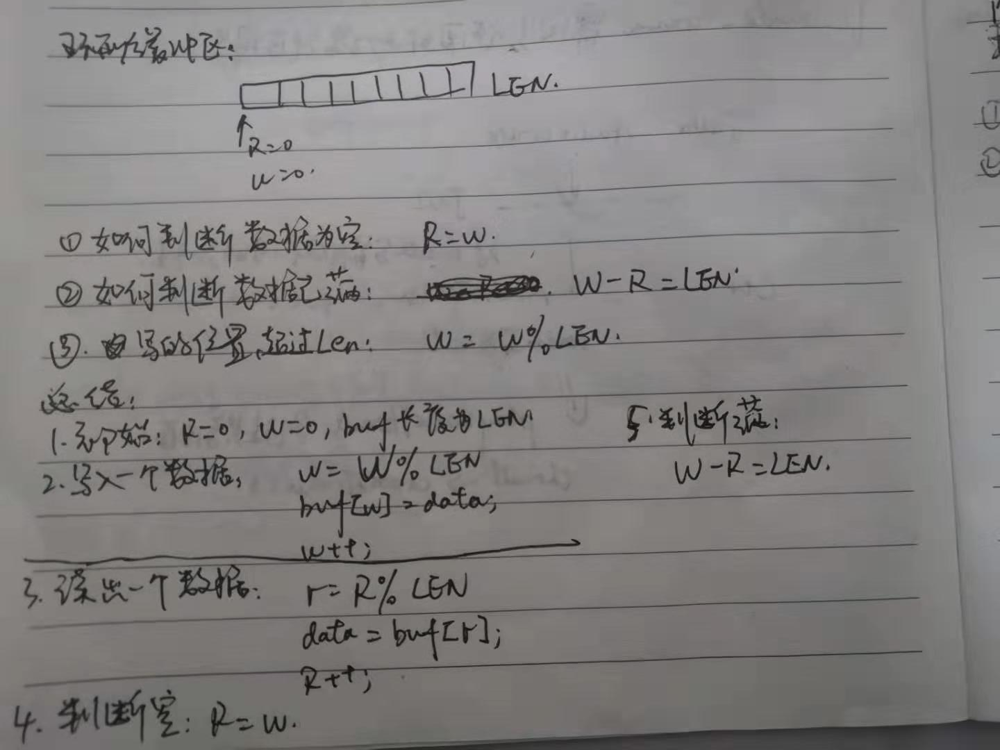
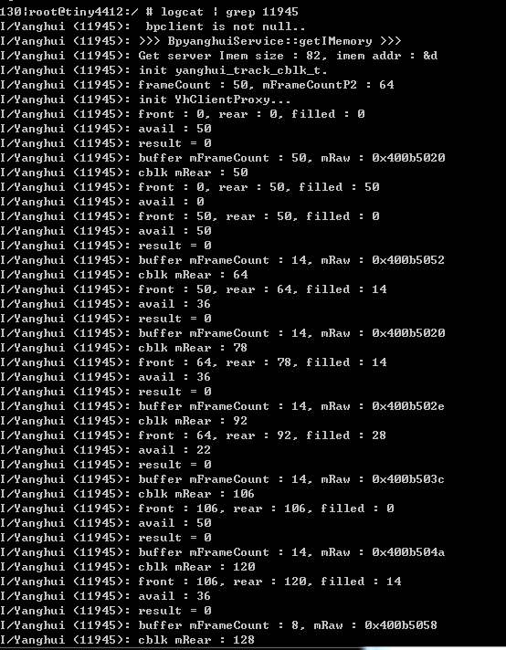
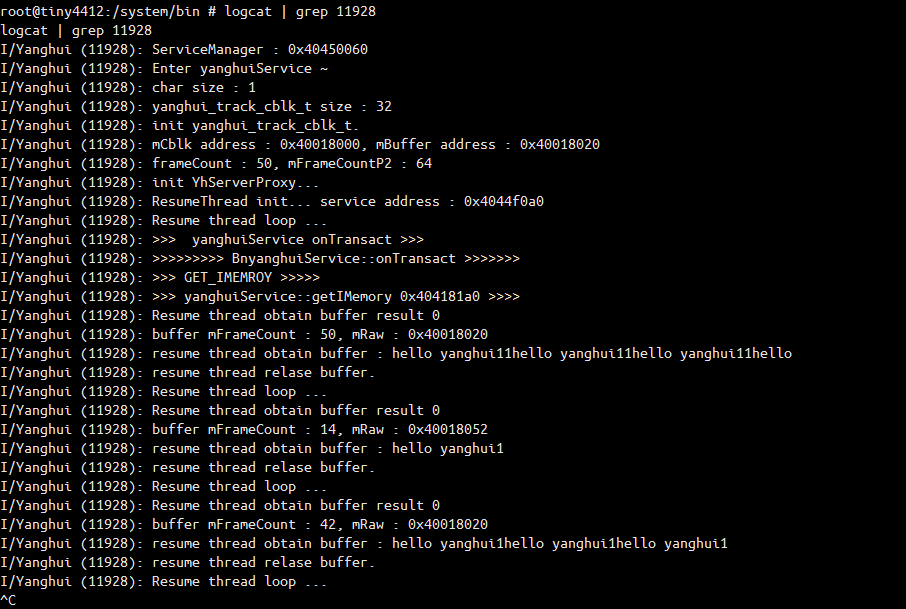

# Android系统音频模块-数据传输工作

## 前言

在Android系统中，比较大块的数据传输一般都是通过binder和共享内存共同完成的，音频亦是如此。由前面两篇文章所知，音频播放有两种模式，一种是static模式，另一种是stream模式。

- static模式一般是像铃声、报警音频这种，音频帧所占buffer不多，但是循环播放的情景，这种模式下是由客户端创建共享内存，并一次性写入音频流。然后通过binder驱动将IMemory代理对象传递给服务端，也就是AudioFlinger所在进程。服务端AudioFlinger就会读取共享内存上的数据循环播放。
- stream模式是一般常用的模式，像音乐播放等。这种模式下，共享内存由服务端创建，也是通过binder驱动传递IMemory的代理对象，来实现通信的，其次，它会在共享内存的头部创建一个audio_track_cblk_t的控制结构体，上面有读写指针等各种信息用于客户端和服务端进程同时对共享内存操作的同步控制，此外stream模式下，使用到了环形缓冲队列来实现。

注意，IMemory是Android系统封装了对共享内存操作的跨进程调用类，它实现了binder驱动所需要的接口函数，为了方便我们操作共享内存，像通过系统调用通知内核打开一块共享内存，然后在用户空间通过fd，mmap将物理内存映射到用户空间地址上。这个到时候有空，专门花篇文章来学些下。

另外在总结之前，要回顾和学习两个知识点，不然后面的代码看不懂。

1. 环形缓冲区的实现：

   

   一般默认为LEN为无穷大，读写指针会一直往后追加，但是实际计算环形缓冲区读写指针一般要%LEN才是实际的地址位置。另一方面，为了加速计算读写指针位置，一般取实际内存字节数最大的幂次方，这样就可以通过求模运算来提高cpu运算性能。

   改进结果：

   写指针：w = W%LEN = W&(LEN-1)

   读指针：r = R%LEN = R&(LEN-1)

   总结：在共享内存的控制单元audio_track_cblk_t里面的读写指针都是实际偏移的位置，但是到客户端和服务端中，获取到读写指针还需要对其进行求模运算，才能计算出在共享内存地址中的位置。

2. 关于进程之间对共享内存同步这块，新版本的代码没有在用到Mutex来操作了，而是使用了CAS和linux进程同步机制futex来实现的。

   代码原型：

   ```c
   #include <linux/futex.h>
   #include <sys/time.h>
   int futex (int *uaddr, int op, int val, const struct timespec *timeout,int *uaddr2, int val3);
   #define __NR_futex              240
   ```

   由于本人能力有限，就不讲述原理了，简单的讲解下参数使用：

   uaddr就是用户态下共享内存的地址，里面存放的是一个对齐的整型计数器。op存放着操作类型。定义的有5种，这里我简单的介绍一下两种，剩下的感兴趣的自己去man futex     FUTEX_WAIT: 原子性的检查uaddr中计数器的值是否为val,如果是则让进程休眠，直到FUTEX_WAKE或者超时(time-out)。也就是把进程挂到uaddr相对应的等待队列上去。FUTEX_WAKE: 最多唤醒val个等待在uaddr上进程。 

   可以参考博文：[Linux进程同步机制-Futex](<https://www.linuxidc.com/Linux/2011-02/32229.htm> )

## 简单实现

由于Android源码比较复杂，不仅有static、stream模式的处理，还有对AudioRecord（录音）的处理，此处我们就参考源码，自己去实现个和播放差不多代码逻辑的。一个好处就可以加深自己对这块知识的理解，另一个避免自己迷失在源码的森林里。

#### 1.客户端生产数据：

```c++
void productData(sp<YhClientProxy>& proxy){

    //客户端获取到可用的buffer，就往共享内存里面写 hello yanghui11.
    for(;;){
		
		Buffer buffer;
		size_t result = proxy->obtainBuffer(&buffer);
		LOGI("result = %d", result);
		if(result == RESULT_OK){
			LOGI("buffer mFrameCount : %d, mRaw : %p", buffer.mFrameCount, buffer.mRaw);
		
			size_t size = buffer.mFrameCount * sizeof(char);
			memset(buffer.mRaw, 0, size);
		
			char* helloStr = "hello yanghui11";
			size_t strSize = sizeof(char) * strlen(helloStr);

            for(int i = 0;i< (size/strSize);i++){
				memcpy(buffer.mRaw + i * strSize, helloStr, strSize);
			}

			if(size % strSize != 0){
                memcpy(buffer.mRaw + (size/strSize)*strSize, helloStr,size%strSize);
			}
			
			proxy->releaseBuffer(&buffer);
		}

		sleep(30);
	}
}

int main(int argc, char** argv){
	
	sp<IServiceManager> sm = defaultServiceManager();
	sp<IBinder> binder = sm->getService(String16("yanghui.IyanghuiService"));
	sp<IyanghuiService> yanghuiService = interface_cast<IyanghuiService>(binder);

    if(yanghuiService != NULL){
		LOGI(" bpclient is not null..");
		const sp<IMemory>& iMem = yanghuiService->getIMemory();
		size_t size = iMem->size();
		int* addrPoint = static_cast<int*>(iMem->pointer());		
		LOGI("Get server Imem size : %d, imem addr : &d",size, *addrPoint);

		size = sizeof(yanghui_track_cblk_t);
		int len = sizeof(char);
		size_t bufferSize = len * 50;
		

		yanghui_track_cblk_t* mCblk = static_cast<yanghui_track_cblk_t *>(iMem->pointer());

		if(mCblk != NULL){

          new(mCblk) yanghui_track_cblk_t();
		  void* mBuffer = (char*)mCblk + sizeof(yanghui_track_cblk_t);
		  proxy = new YhClientProxy(mCblk, mBuffer, 50, len);

          productData(proxy);
		}
		

	}   

	sleep(60 * 1000 * 30);
	return 0;
}

```


#### 2.服务端不断的去读数据：

```c++
	yanghuiService::yanghuiService(){

		LOGI("Enter yanghuiService ~");

         int len = sizeof(char);
		LOGI("char size : %d", sizeof(char));
		sp<MemoryDealer> mMemoryDealer = new MemoryDealer(len * 100, "yanghui_Memory");
		size_t size = sizeof(yanghui_track_cblk_t);
		size_t bufferSize = len * 50;
		LOGI("yanghui_track_cblk_t size : %d ",size);
		sp<IMemory> tmp = mMemoryDealer->allocate(size + bufferSize);

         yanghui_track_cblk_t* mCblk = static_cast<yanghui_track_cblk_t*>(tmp->pointer());
		new (mCblk) yanghui_track_cblk_t();
		            

		void* mBuffer = (char*)mCblk + sizeof(yanghui_track_cblk_t);
		LOGI("mCblk address : %p, mBuffer address : %p",mCblk,mBuffer);
		memset(mBuffer,0,bufferSize);

		this->serverProxy = new YhServerProxy(mCblk, mBuffer,50,len);
		this->imem = tmp;

		this->thread = new ResumeThread(this);
		(this->thread)->run("resumeThread",PRIORITY_DEFAULT,0);
		(this->thread)->incStrong(this);
	}


    class ResumeThread : public Thread {
	 
	 public :
	   ResumeThread(yanghuiService* service):service(service){
          LOGI("ResumeThread init... service address : %p", service);
	   }
	   ~ResumeThread(){
	   	  //todo release resource.
          LOGI("destroy resume thread ...");
	   }
	   
	   bool threadLoop(){
		   
		   LOGI("Resume thread loop ...");
		   sleep(60);
		   if(service != NULL){
              sp<YhServerProxy> proxy = service->serverProxy;
			  if(proxy != NULL){
			  	  Buffer buffer;
				  buffer.mFrameCount = 50;
                  size_t result = proxy->obtainBuffer(&buffer);
				  LOGI("Resume thread obtain buffer result %d", result);

				  if(result == RESULT_OK){

                      LOGI("buffer mFrameCount : %d, mRaw : %p", buffer.mFrameCount, buffer.mRaw);
                      size_t size = buffer.mFrameCount * sizeof(char);
					  char* s = new char[size];
					  memcpy(s,buffer.mRaw,size);
					  LOGI("resume thread obtain buffer : %s", s);

					  proxy->releaseBuffer(&buffer);
					  LOGI("resume thread relase buffer.");
				  } else {
                      LOGE("obtain buffer failed...");
				  }
			  }
		   }
		   
		   return true;
	   }

	 private :
	 	yanghuiService* service;
 };
```


#### 3.打印结果：

客户端打印：




服务端打印：




对共享内存控制那块的代码就不贴了，比较多，比较感兴趣的同学可以到我的github上下载：

<https://github.com/Nipuream/Framework-Study/tree/master/SMJni/SMJni/external> 

由于个人能力问题，如果有表述错误或理解错误的欢迎指出~